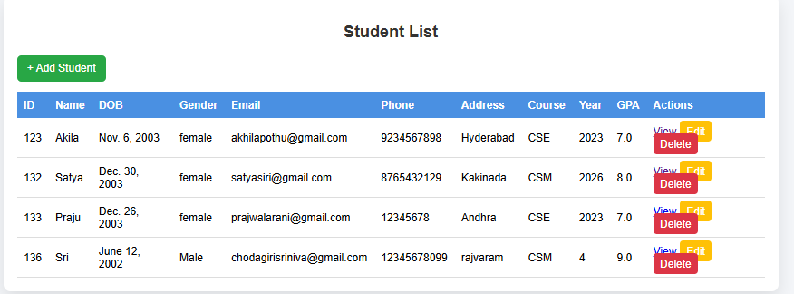
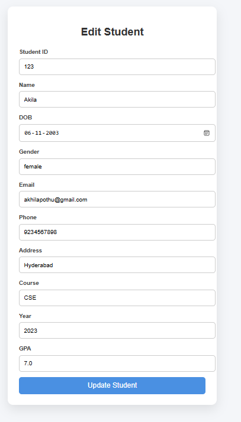
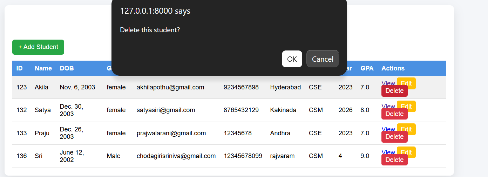
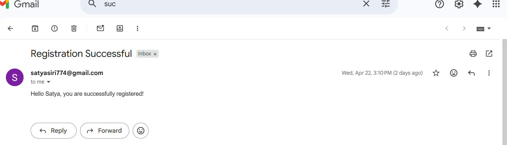

# 🎓 Student Details Management System

This is a Django-based project that I built to manage student details using CRUD operations.
In this project, I focused on understanding how backend works in real-time applications.

---

## 🚀 About the Project

In this project, I created a system where we can:

* Add new student details
* View all student records
* Update existing student information
* Delete student data

After successful registration, the system also sends a confirmation email to the student.

---

## 🛠️ Technologies Used

* Python
* Django
* HTML, CSS
* SQLite
* SMTP (for sending emails)

---

## ⚙️ Features

* Student Registration Form
* Full CRUD Operations
* Email notification after registration
* Simple and clean interface
* Django Admin panel support

---

## 📸 Project Screenshots

### 📝 Registration Form

### 📋 Students List

### ✏️ Update Student

### ❌ Delete Student

### 📧 Email Notification

---

## 📂 Project Structure

student_management_system/
│
├── studentdetails/
├── students/
├── images/
├── db.sqlite3
├── manage.py

---

## 🔧 How to Run This Project

1. Clone the repository
2. Go to project folder
3. Install requirements

pip install -r requirements.txt

4. Run migrations

python manage.py migrate

5. Start the server

python manage.py runserver

---
## 🔧 My Way To Installation & Setup:
# Clone the repository
git clone https://github.com/satya4229/student_management_system.git

# Navigate to project directory
cd student_management_system

# Install dependencies
pip install -r requirements.txt

# Apply migrations
python manage.py migrate

# Run the development server
python manage.py runserver

## 📧 Email Feature

Email Functionality

After a student successfully registers, a confirmation email is automatically sent using SMTP.

This feature demonstrates:

Real-time backend processing
Email integration in Django
Improved user communication

---

## 🎯 What I Learned

* Implementing CRUD operations in Django
* Handling forms and user input
* Working with SQLite database
* Integrating email functionality using SMTP
* Understanding Django project structure

---

## 👨‍💻 Author

Satya  
Aspiring Python Developer
